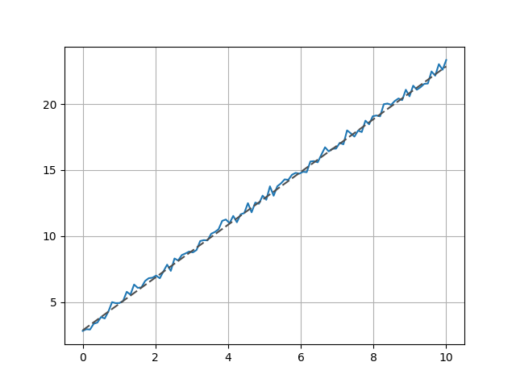
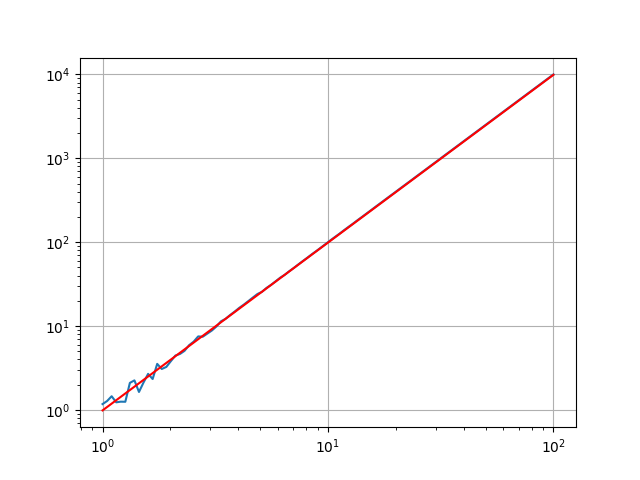
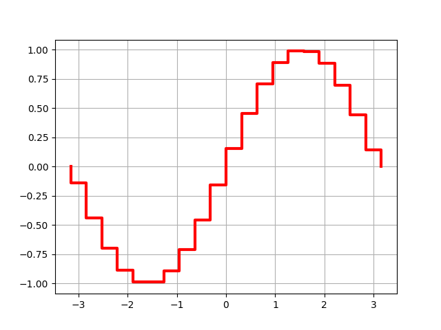

mplshared
=========

Some tools for matplotlib.

Installation
------------

.. code-block::
    pip install --upgrade mplshared

Usage
-----

Slope Lines
:::::::::::

In plots with linearly scaling axes:

.. code-block:: ipython

    import matplotlib.pyplot as plt
    from mplshared import SlopeLine

    # Get some random data:
    x = np.linspace(0, 10, 100)
    y = noisify(2 * x + 3)

    # Plot it:
    plt.plot(x, y)

    # Add a slope line:

    slope_line = SlopeLine(slope=2, through=(x[5], y[5]), domain=(0, 10))
    plt.gca().add_line(slope_line)
    plt.show()

If you have a loglog plot, just change the scale argument:

.. code-block:: ipython

    slope_line = SlopeLine(slope=2,
                       through=(x[40], y[40]),
                       domain=(1, 100),
                       scale='loglog',
                       style={'color': 'red'}
                       )

StepFunctionLine
----------------

.. code-block:: ipython

    import numpy as np
    import matplotlib.pyplot as plt

    from mplshared import StepFunctionLine

    x = np.linspace(-3, 3, 20)
    y = np.sin(x)

    sf1 = StepFunctionLine(x, y, linewidth=3, color='red')
    plt.gca().add_line(sf1)
    sf1.autolims(plt)
    plt.show()

